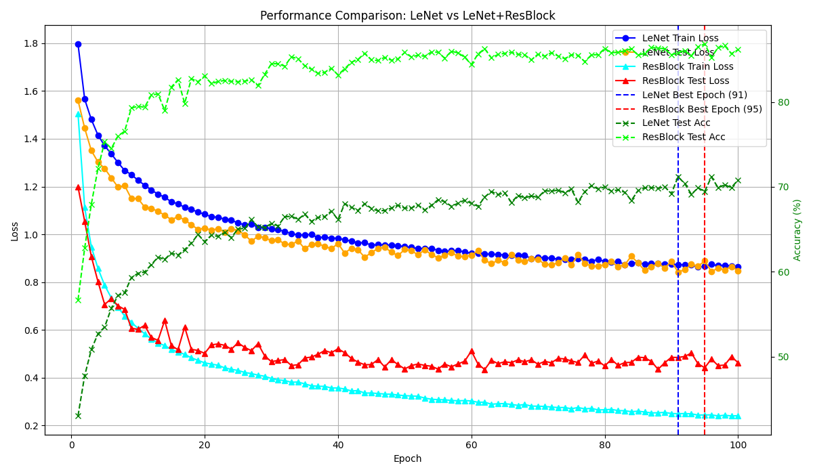
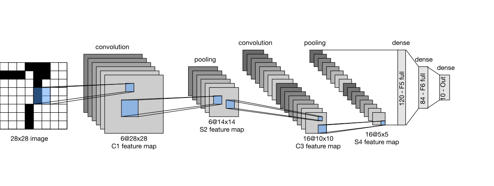

# 🧠 CIFAR-10 Classification with LeNet-5 and ResBlock Enhanced LeNet 
### (HW for DL course @ NEUQ - by Chiashu Wang 王家澍)

This is the FIRST homework of Deep Learning course @ NEUQ (Northeastern University at Qinhuangdao)

The project implements and compares two convolutional neural network architectures on the CIFAR-10 dataset:

- **LeNet-5** (adapted for RGB images)
- **LeNet-5 with Residual Blocks (ResBlock)**

See the architectures of the models in the [Implementation Details](#implementation-details) section.

The models are trained and evaluated using PyTorch, with performance metrics plotted for comparison.

---

## 📈 RESULT


---

## ⚡ Quick Start 

This project is tested and runs smoothly in the [**d2l-zh**](https://github.com/d2l-ai/d2l-zh) environment.

Once you're inside the **d2l-zh** environment, simply run:

```bash
python main.py
```
This will start the training of the two independent neural networks.

Output will be two **.pth** files of the *best epoch weights* for both models and *a line chart* showing how the metrics change over epoches.

---

## Implementation Details

The LeNet architecture follows the original design proposed by LeCun et al. ([paper link](http://yann.lecun.com/exdb/publis/pdf/lecun-01a.pdf)).




The enhanced version, referred to as *LeNet with ResBlocks*, builds upon the original LeNet architecture by incorporating a total of four Residual Blocks—two after each convolutional layer.

### Modified LeNet with ResBlocks (Layer-wise)

1. Conv1 → BN → ReLU → ResBlock → ResBlock → Pool1  
2. Conv2 → BN → ReLU → ResBlock → ResBlock → Pool2    
3. FC1 → ReLU → FC2 → ReLU → FC3


---

## 🖥️ Runtime Environment

The project was tested on the following devices:

| Computational Resources | Remark           |
|-------------------------|------------------|
| NVIDIA RTX 3090         | Training          |
| Apple M1                | Local debugging   |

> *Note: The Apple M1 can also train this model, but very slow tho.*

---

## 📚 References

- **LeNet-5**  
  LeCun, Y., Bottou, L., Bengio, Y., & Haffner, P. (1998).  
  *Gradient-based learning applied to document recognition.* Proceedings of the IEEE.  
  [Paper link](http://yann.lecun.com/exdb/publis/pdf/lecun-01a.pdf)

- **ResNet**  
  He, K., Zhang, X., Ren, S., & Sun, J. (2016).  
  *Deep Residual Learning for Image Recognition.* In CVPR.  
  [Paper link](https://arxiv.org/abs/1512.03385)

- **D2L (Dive into Deep Learning)**  
  Aston Zhang, Zachary C. Lipton, Mu Li, and Alexander J. Smola.  
  *Dive into Deep Learning.*  
  [GitHub Repo (Chinese version)](https://github.com/d2l-ai/d2l-zh)